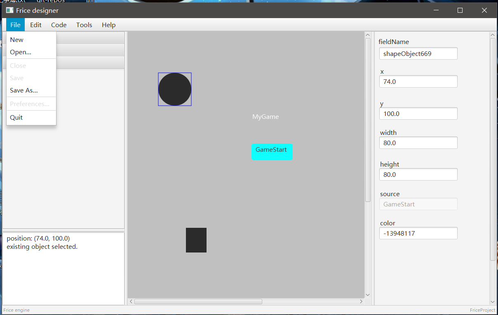

# FriceDesigner

CI|Status
:---:|:---:
Travis CI|
AppVeyor|
CircleCI|
CodeShip|

A GUI designer for Frice Engine.

## Screen Shots

### Editor

Code generator:

 

Backup your editing work into a file.

 

Running the exported code:

 

See? A Visual Editor. Like it? It's based on JavaFX.

## About Frice Engine

[Frice Engine](https://github.com/icela/FriceEngine)
